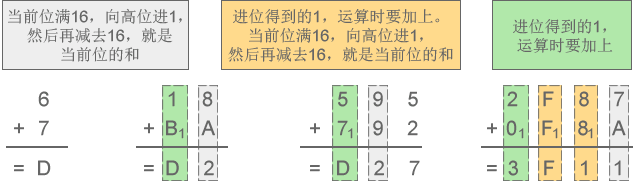
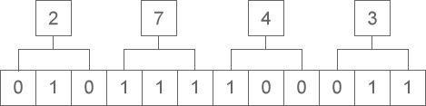
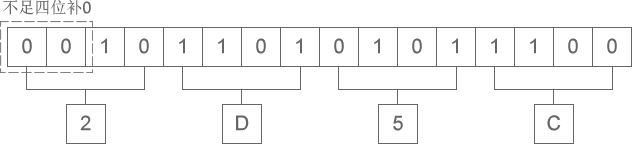

[参考](http://c.biancheng.net/c/10/)

- [编程基础](#编程基础)
    - [1.二进制](#1二进制)
        - [1.1 二进制加法](#11-二进制加法)
        - [1.2 二进制减法](#12-二进制减法)
    - [2.八进制](#2八进制)
        - [2.1 八进制加法](#21-八进制加法)
        - [2.2 八进制减法](#22-八进制减法)
    - [3.十六进制](#3十六进制)
        - [3.1 十六进制加法](#31-十六进制加法)
        - [3.2 十六进制减法](#32-十六进制减法)
    - [4.进制转换](#4进制转换)
        - [4.1 二进制、八进制、十六进制转换为十进制](#41-二进制八进制十六进制转换为十进制)
            - [4.1.1 整数部分](#411-整数部分)
            - [4.1.2 小数部分](#412-小数部分)
        - [4.2 十进制转换为二进制、八进制、十六进制](#42-十进制转换为二进制八进制十六进制)
            - [4.2.1 整数部分](#421-整数部分)
            - [4.2.2 小数部分](#422-小数部分)
        - [4.3 二进制和八进制、十六进制的转换](#43-二进制和八进制十六进制的转换)
            - [4.3.1 二进制整数和八进制整数之间的转换](#431-二进制整数和八进制整数之间的转换)
            - [4.3.2 二进制整数和十六进制整数之间的转换](#432-二进制整数和十六进制整数之间的转换)
        - [4.4 总结](#44-总结)
    - [5.数据在内存中的存储](#5数据在内存中的存储)
        - [5.1 虚拟内存](#51-虚拟内存)
    - [6.ASCII 编码](#6ASCII-编码)
        - [6.1 ASCII 编码一览表](#61-ASCII 编码一览表)
        - [6.2 ASCII 编码和C语言](#62-ASCII 编码和C语言)

------

# 编程基础

我们平时使用的数字都是由 0~9 共十个数字组成的，例如 1、9、10、297、952 等，一个数字最多能表示九，如果要表示十、十一、二十九、一百等，就需要多个数字组合起来。

例如表示 5+8 的结果，一个数字不够，只能”进位“，用 13 来表示；这时”进一位“相当于十，”进两位“相当于二十。

因为逢十进一（满十进一），也因为只有 0~9 共十个数字，所以叫做十进制（Decimalism）。十进制是在人类社会发展过程中自然形成的，它符合人们的思维习惯，例如人类有十根手指，也有十根脚趾。

进制也就是进位制。进行加法运算时逢X进一（满X进一），进行减法运算时借一当X，这就是X进制，这种进制也就包含X个数字，基数为X。十进制有 0~9 共10个数字，基数为10，在加减法运算中，逢十进一，借一当十。

## 1.二进制

我们不妨将思维拓展一下，既然可以用 0~9 共十个数字来表示数值，那么也可以用0、1两个数字来表示数值，这就是二进制（Binary）。例如，数字 0、1、10、111、100、1000001 都是有效的二进制。

在计算机内部，数据都是以二进制的形式存储的，二进制是学习编程必须掌握的基础。本节我们先讲解二进制的概念，下节讲解数据在内存中的存储，让大家学以致用。

二进制加减法和十进制加减法的思想是类似的：

- 对于十进制，进行加法运算时逢十进一，进行减法运算时借一当十；
- 对于二进制，进行加法运算时逢二进一，进行减法运算时借一当二。

下面两张示意图详细演示了二进制加减法的运算过程。

### 1.1 二进制加法

1+0=1、1+1=10、11+10=101、111+111=1110

### 1.2 二进制减法

1-0=1、10-1=1、101-11=10、1100-111=101

## 2.八进制

除了二进制，C语言还会使用到八进制。

八进制有 0~7 共8个数字，基数为8，加法运算时逢八进一，减法运算时借一当八。例如，数字 0、1、5、7、14、733、67001、25430 都是有效的八进制。

下面两张图详细演示了八进制加减法的运算过程。

### 2.1 八进制加法

3+4=7、5+6=13、75+42=137、2427+567=3216

### 2.2 八进制减法

6-4=2、52-27=23、307-141=146、7430-1451=5757

## 3.十六进制

除了二进制和八进制，十六进制也经常使用，甚至比八进制还要频繁。

十六进制中，用A来表示10，B表示11，C表示12，D表示13，E表示14，F表示15，因此有 0~F 共16个数字，基数为16，加法运算时逢16进1，减法运算时借1当16。例如，数字 0、1、6、9、A、D、F、419、EA32、80A3、BC00 都是有效的十六进制。

> 注意，十六进制中的字母不区分大小写，ABCDEF 也可以写作 abcdef。

下面两张图详细演示了十六进制加减法的运算过程。

### 3.1 十六进制加法

6+7=D、18+BA=D2、595+792=D27、2F87+F8A=3F11

### 3.2 十六进制减法

D-3=A、52-2F=23、E07-141=CC6、7CA0-1CB1=5FEF

## 4.进制转换

### 4.1 二进制、八进制、十六进制转换为十进制

二进制、八进制和十六进制向十进制转换都非常容易，就是“按权相加”。所谓“权”，也即“位权”。

假设当前数字是 N 进制，那么：

- 对于整数部分，从右往左看，第 i 位的位权等于Ni-1
- 对于小数部分，恰好相反，要从左往右看，第 j 位的位权为N-j。

更加通俗的理解是，假设一个多位数（由多个数字组成的数）某位上的数字是 1，那么它所表示的数值大小就是该位的位权。

#### 4.1.1 整数部分

例如，**将八进制数字 53627 转换成十进制**：

53627 = 5×84 + 3×83 + 6×82 + 2×81 + 7×80 = 22423（十进制）

从右往左看，第1位的位权为 80=1，第2位的位权为 81=8，第3位的位权为 82=64，第4位的位权为 83=512，第5位的位权为 84=4096 …… 第n位的位权就为 8n-1。将各个位的数字乘以位权，然后再相加，就得到了十进制形式。

> 注意，这里我们需要以十进制形式来表示位权。

再如，**将十六进制数字 9FA8C 转换成十进制**：

9FA8C = 9×164 + 15×163 + 10×162 + 8×161 + 12×160 = 653964（十进制）

从右往左看，第1位的位权为 160=1，第2位的位权为 161=16，第3位的位权为 162=256，第4位的位权为 163=4096，第5位的位权为 164=65536 …… 第n位的位权就为 16n-1。将各个位的数字乘以位权，然后再相加，就得到了十进制形式。

将**二进制数字转换成十进制也是类似的道理**：

11010 = 1×24 + 1×23 + 0×22 + 1×21 + 0×20 = 26（十进制）

从右往左看，第1位的位权为 20=1，第2位的位权为 21=2，第3位的位权为 22=4，第4位的位权为 23=8，第5位的位权为 24=16 …… 第n位的位权就为 2n-1。将各个位的数字乘以位权，然后再相加，就得到了十进制形式。

#### 4.1.2 小数部分

例如，将**八进制数字 423.5176 转换成十进制**：

423.5176 = 4×82 + 2×81 + 3×80 + 5×8-1 + 1×8-2 + 7×8-3 + 6×8-4 = 275.65576171875（十进制）

小数部分和整数部分相反，要从左往右看，第1位的位权为 8-1=1/8，第2位的位权为 8-2=1/64，第3位的位权为 8-3=1/512，第4位的位权为 8-4=1/4096 …… 第m位的位权就为 8-m。

再如，将**二进制数字 1010.1101 转换成十进制**：

1010.1101 = 1×23 + 0×22 + 1×21 + 0×20 + 1×2-1 + 1×2-2 + 0×2-3 + 1×2-4 = 10.8125（十进制）

小数部分和整数部分相反，要从左往右看，第1位的位权为 2-1=1/2，第2位的位权为 2-2=1/4，第3位的位权为 2-3=1/8，第4位的位权为 2-4=1/16 …… 第m位的位权就为 2-m。

**更多转换成十进制的例子**：

- 二进制：1001 = 1×23 + 0×22 + 0×21 + 1×20 = 8 + 0 + 0 + 1 = 9（十进制）
- 二进制：101.1001 = 1×22 + 0×21 + 1×20 + 1×2-1 + 0×2-2 + 0×2-3 + 1×2-4 = 4 + 0 + 1 + 0.5 + 0 + 0 + 0.0625 = 5.5625（十进制）
- 八进制：302 = 3×82 + 0×81 + 2×80 = 192 + 0 + 2 = 194（十进制）
- 八进制：302.46 = 3×82 + 0×81 + 2×80 + 4×8-1 + 6×8-2 = 192 + 0 + 2 + 0.5 + 0.09375= 194.59375（十进制）
- 十六进制：EA7 = 14×162 + 10×161 + 7×160 = 3751（十进制）

### 4.2 十进制转换为二进制、八进制、十六进制

将十进制转换为其它进制时比较复杂，整数部分和小数部分的算法不一样，下面我们分别讲解。

#### 4.2.1 整数部分

十进制整数转换为 N 进制整数采用“除 N 取余，逆序排列”法。具体做法是：

- 将 N 作为除数，用十进制整数除以 N，可以得到一个商和余数；
- 保留余数，用商继续除以 N，又得到一个新的商和余数；
- 仍然保留余数，用商继续除以 N，还会得到一个新的商和余数；
- ……
- 如此反复进行，每次都保留余数，用商接着除以 N，直到商为 0 时为止。

把先得到的余数作为 N 进制数的低位数字，后得到的余数作为 N 进制数的高位数字，依次排列起来，就得到了 N 进制数字。

下图演示了将十进制数字 36926 转换成八进制的过程：

从图中得知，十进制数字 36926 转换成八进制的结果为 110076。

下图演示了将十进制数字 42 转换成二进制的过程：

从图中得知，十进制数字 42 转换成二进制的结果为 101010。

#### 4.2.2 小数部分

十进制小数转换成 N 进制小数采用“乘 N 取整，顺序排列”法。具体做法是：

- 用 N 乘以十进制小数，可以得到一个积，这个积包含了整数部分和小数部分；
- 将积的整数部分取出，再用 N 乘以余下的小数部分，又得到一个新的积；
- 再将积的整数部分取出，继续用 N 乘以余下的小数部分；
- ……
- 如此反复进行，每次都取出整数部分，用 N 接着乘以小数部分，直到积中的小数部分为 0，或者达到所要求的精度为止。

把取出的整数部分按顺序排列起来，先取出的整数作为 N 进制小数的高位数字，后取出的整数作为低位数字，这样就得到了 N 进制小数。

下图演示了将十进制小数 0.930908203125 转换成八进制小数的过程：

从图中得知，十进制小数 0.930908203125 转换成八进制小数的结果为 0.7345。

下图演示了将十进制小数 0.6875 转换成二进制小数的过程：

从图中得知，十进制小数 0.6875 转换成二进制小数的结果为 0.1011。

如果一个数字既包含了整数部分又包含了小数部分，那么将整数部分和小数部分开，分别按照上面的方法完成转换，然后再合并在一起即可。例如：

- 十进制数字 36926.930908203125 转换成八进制的结果为 110076.7345；
- 十进制数字 42.6875 转换成二进制的结果为 101010.1011。

下表列出了前 17 个十进制整数与二进制、八进制、十六进制的对应关系：

| 十进制   | 0    | 1    | 2    | 3    | 4    | 5    | 6    | 7    | 8    | 9    | 10   | 11   | 12   | 13   | 14   | 15   | 16    |
| -------- | ---- | ---- | ---- | ---- | ---- | ---- | ---- | ---- | ---- | ---- | ---- | ---- | ---- | ---- | ---- | ---- | ----- |
| 二进制   | 0    | 1    | 10   | 11   | 100  | 101  | 110  | 111  | 1000 | 1001 | 1010 | 1011 | 1100 | 1101 | 1110 | 1111 | 10000 |
| 八进制   | 0    | 1    | 2    | 3    | 4    | 5    | 6    | 7    | 10   | 11   | 12   | 13   | 14   | 15   | 16   | 17   | 20    |
| 十六进制 | 0    | 1    | 2    | 3    | 4    | 5    | 6    | 7    | 8    | 9    | A    | B    | C    | D    | E    | F    | 10    |

注意，十进制小数转换成其他进制小数时，结果有可能是一个无限位的小数。请看下面的例子：

- 十进制 0.51 对应的二进制为 0.100000101000111101011100001010001111010111...，是一个循环小数；
- 十进制 0.72 对应的二进制为 0.1011100001010001111010111000010100011110...，是一个循环小数；
- 十进制 0.625 对应的二进制为 0.101，是一个有限小数。

### 4.3 二进制和八进制、十六进制的转换

其实，任何进制之间的转换都可以使用上面讲到的方法，只不过有时比较麻烦，所以一般针对不同的进制采取不同的方法。将二进制转换为八进制和十六进制时就有非常简洁的方法，反之亦然。

#### 4.3.1 二进制整数和八进制整数之间的转换

二进制整数转换为八进制整数时，每三位二进制数字转换为一位八进制数字，运算的顺序是从低位向高位依次进行，高位不足三位用零补齐。下图演示了如何将二进制整数 1110111100 转换为八进制：

从图中可以看出，二进制整数 1110111100 转换为八进制的结果为 1674。

八进制整数转换为二进制整数时，思路是相反的，每一位八进制数字转换为三位二进制数字，运算的顺序也是从低位向高位依次进行。下图演示了如何将八进制整数 2743 转换为二进制：

从图中可以看出，八进制整数 2743 转换为二进制的结果为 10111100011。

#### 4.3.2 二进制整数和十六进制整数之间的转换

二进制整数转换为十六进制整数时，每四位二进制数字转换为一位十六进制数字，运算的顺序是从低位向高位依次进行，高位不足四位用零补齐。下图演示了如何将二进制整数 10 1101 0101 1100 转换为十六进制：

从图中可以看出，二进制整数 10 1101 0101 1100 转换为十六进制的结果为 2D5C。

十六进制整数转换为二进制整数时，思路是相反的，每一位十六进制数字转换为四位二进制数字，运算的顺序也是从低位向高位依次进行。下图演示了如何将十六进制整数 A5D6 转换为二进制：

从图中可以看出，十六进制整数 A5D6 转换为二进制的结果为 1010 0101 1101 0110。

在C语言编程中，二进制、八进制、十六进制之间几乎不会涉及小数的转换，所以这里我们只讲整数的转换，大家学以致用足以。另外，八进制和十六进制之间也极少直接转换，这里我们也不再讲解了。

### 4.4 总结

本节前面两部分讲到的转换方法是通用的，任何进制之间的转换都可以采用，只是有时比较麻烦而已。二进制和八进制、十六进制之间的转换有非常简洁的方法，所以没有采用前面的方法。

## 5.数据在内存中的存储

内存条是一个非常精密的部件，包含了上亿个电子元器件，它们很小，达到了纳米级别。这些元器件，实际上就是电路；电路的电压会变化，要么是 0V，要么是 5V，只有这两种电压。5V 是通电，用1来表示，0V 是断电，用0来表示。所以，一个元器件有2种状态，0 或者 1。

我们通过电路来控制这些元器件的通断电，会得到很多0、1的组合。例如，8个元器件有 28=256 种不同的组合，16个元器件有 216=65536 种不同的组合。虽然一个元器件只能表示2个数值，但是多个结合起来就可以表示很多数值了。

我们可以给每一种组合赋予特定的含义，例如，可以分别用 1101000、00011100、11111111、00000000、01010101、10101010 来表示 C、语、言、中、文、网 这几个字，那么结合起来 1101000 00011100 11111111 00000000 01010101 10101010 就表示”C语言中文网“。

一般情况下我们不一个一个的使用元器件，而是将8个元器件看做一个单位，即使表示很小的数，例如 1，也需要8个，也就是 00000001。

1个元器件称为1比特（Bit）或1位，8个元器件称为1字节（Byte），那么16个元器件就是2Byte，32个就是4Byte，以此类推：

- 8×1024个元器件就是1024Byte，简写为1KB；
- 8×1024×1024个元器件就是1024KB，简写为1MB；
- 8×1024×1024×1024个元器件就是1024MB，简写为1GB。

现在，你知道1GB的内存有多少个元器件了吧。我们通常所说的文件大小是多少 KB、多少 MB，就是这个意思。

单位换算：

- 1Byte = 8 Bit
- 1KB = 1024Byte = 210Byte
- 1MB = 1024KB = 220Byte
- 1GB = 1024MB = 230Byte
- 1TB = 1024GB = 240Byte
- 1PB = 1024TB = 250Byte
- 1EB = 1024PB = 260Byte

我们平时使用计算机时，通常只会设计到 KB、MB、GB、TB 这几个单位，PB 和 EB 这两个高级单位一般在[大数据](http://c.biancheng.net/big_data/)处理过程中才会用到。

### 5.1 虚拟内存

如果我们运行的程序较多，占用的空间就会超过内存（内存条）容量。例如计算机的内存容量为2G，却运行着10个程序，这10个程序共占用3G的空间，也就意味着需要从硬盘复制 3G 的数据到内存，这显然是不可能的。

操作系统（Operating System，简称 OS）为我们解决了这个问题：当程序运行需要的空间大于内存容量时，会将内存中暂时不用的数据再写回硬盘；需要这些数据时再从硬盘中读取，并将另外一部分不用的数据写入硬盘。这样，硬盘中就会有一部分空间用来存放内存中暂时不用的数据。这一部分空间就叫做虚拟内存（Virtual Memory）。

3G - 2G = 1G，上面的情况需要在硬盘上分配 1G 的虚拟内存。

硬盘的读写速度比内存慢很多，反复交换数据会消耗很多时间，所以如果你的内存太小，会严重影响计算机的运行速度，甚至会出现”卡死“现象，即使CPU强劲，也不会有大的改观。如果经济条件允许，建议将内存升级为 4G，在 win7、win8、win10 下运行软件就会比较流畅了。

**CPU直接从内存中读取数据，处理完成后将结果再写入内存。**

## 6.ASCII 编码

计算机是美国人发明的，他们首先要考虑的问题是，如何将二进制和英文字母（也就是拉丁文）对应起来。

当时，各个厂家或者公司都有自己的做法，编码规则并不统一，这给不同计算机之间的数据交换带来不小的麻烦。但是相对来说，能够得到普遍认可的有 IBM 发明的 EBCDIC 和此处要谈的 ASCII。

我们先说 ASCII。ASCII 是“American S[tan](http://c.biancheng.net/ref/tan.html)dard Code for Information Interchange”的缩写，翻译过来是“美国信息交换标准代码”。看这个名字就知道，这套编码是美国人给自己设计的，他们并没有考虑欧洲那些扩展的拉丁字母，也没有考虑韩语和日语，我大中华几万个汉字更是不可能被重视。

但这也无可厚非，美国人自己发明的计算机，当然要先解决自己的问题

ASCII 的标准版本于 1967 年第一次发布，最后一次更新则是在 1986 年，迄今为止共收录了 128 个字符，包含了基本的拉丁字母（英文字母）、阿拉伯数字（也就是 1234567890）、标点符号（`,.!`等）、特殊符号（`@#$%^&`等）以及一些具有控制功能的字符（往往不会显示出来）。

在 ASCII 编码中，大写字母、小写字母和阿拉伯数字都是连续分布的（见下表），这给程序设计带来了很大的方便。例如要判断一个字符是否是大写字母，就可以判断该字符的 ASCII 编码值是否在 65~90 的范围内。

EBCDIC 编码正好相反，它的英文字母不是连续排列的，中间出现了多次断续，给编程带来了一些困难。现在连 IBM 自己也不使用 EBCDIC 了，转而使用更加优秀的 ASCII。

ASCII 编码已经成了计算机的通用标准，没有人再使用 EBCDIC 编码了，它已经消失在历史的长河中了。

### 6.1 ASCII 编码一览表

标准 ASCII 编码共收录了 128 个字符，其中包含了 33 个控制字符（具有某些特殊功能但是无法显示的字符）和 95 个可显示字符。

| 二进制   | 十进制 | 十六进制 | 字符/缩写                                    | 解释                               |
| -------- | ------ | -------- | -------------------------------------------- | ---------------------------------- |
| 00000000 | 0      | 00       | NUL (NULL)                                   | 空字符                             |
| 00000001 | 1      | 01       | SOH (Start Of Headling)                      | 标题开始                           |
| 00000010 | 2      | 02       | STX (Start Of Text)                          | 正文开始                           |
| 00000011 | 3      | 03       | ETX (End Of Text)                            | 正文结束                           |
| 00000100 | 4      | 04       | EOT (End Of Transmission)                    | 传输结束                           |
| 00000101 | 5      | 05       | ENQ (Enquiry)                                | 请求                               |
| 00000110 | 6      | 06       | ACK (Acknowledge)                            | 回应/响应/收到通知                 |
| 00000111 | 7      | 07       | BEL (Bell)                                   | 响铃                               |
| 00001000 | 8      | 08       | BS (Backspace)                               | 退格                               |
| 00001001 | 9      | 09       | HT (Horizontal Tab)                          | 水平制表符                         |
| 00001010 | 10     | 0A       | LF/NL(Line Feed/New Line)                    | 换行键                             |
| 00001011 | 11     | 0B       | VT (Vertical Tab)                            | 垂直制表符                         |
| 00001100 | 12     | 0C       | FF/NP (Form Feed/New Page)                   | 换页键                             |
| 00001101 | 13     | 0D       | CR (Carriage Return)                         | 回车键                             |
| 00001110 | 14     | 0E       | SO (Shift Out)                               | 不用切换                           |
| 00001111 | 15     | 0F       | SI (Shift In)                                | 启用切换                           |
| 00010000 | 16     | 10       | DLE (Data Link Escape)                       | 数据链路转义                       |
| 00010001 | 17     | 11       | DC1/XON (Device Control 1/Transmission On)   | 设备控制1/传输开始                 |
| 00010010 | 18     | 12       | DC2 (Device Control 2)                       | 设备控制2                          |
| 00010011 | 19     | 13       | DC3/XOFF (Device Control 3/Transmission Off) | 设备控制3/传输中断                 |
| 00010100 | 20     | 14       | DC4 (Device Control 4)                       | 设备控制4                          |
| 00010101 | 21     | 15       | NAK (Negative Acknowledge)                   | 无响应/非正常响应/拒绝接收         |
| 00010110 | 22     | 16       | SYN (Synchronous Idle)                       | 同步空闲                           |
| 00010111 | 23     | 17       | ETB (End of Transmission Block)              | 传输块结束/块传输终止              |
| 00011000 | 24     | 18       | CAN (Cancel)                                 | 取消                               |
| 00011001 | 25     | 19       | EM (End of Medium)                           | 已到介质末端/介质存储已满/介质中断 |
| 00011010 | 26     | 1A       | SUB (Substitute)                             | 替补/替换                          |
| 00011011 | 27     | 1B       | ESC (Escape)                                 | 逃离/取消                          |
| 00011100 | 28     | 1C       | FS (File Separator)                          | 文件分割符                         |
| 00011101 | 29     | 1D       | GS (Group Separator)                         | 组分隔符/分组符                    |
| 00011110 | 30     | 1E       | RS (Record Separator)                        | 记录分离符                         |
| 00011111 | 31     | 1F       | US (Unit Separator)                          | 单元分隔符                         |
| 00100000 | 32     | 20       | (Space)                                      | 空格                               |
| 00100001 | 33     | 21       | !                                            |                                    |
| 00100010 | 34     | 22       | "                                            |                                    |
| 00100011 | 35     | 23       | #                                            |                                    |
| 00100100 | 36     | 24       | $                                            |                                    |
| 00100101 | 37     | 25       | %                                            |                                    |
| 00100110 | 38     | 26       | &                                            |                                    |
| 00100111 | 39     | 27       | '                                            |                                    |
| 00101000 | 40     | 28       | (                                            |                                    |
| 00101001 | 41     | 29       | )                                            |                                    |
| 00101010 | 42     | 2A       | *                                            |                                    |
| 00101011 | 43     | 2B       | +                                            |                                    |
| 00101100 | 44     | 2C       | ,                                            |                                    |
| 00101101 | 45     | 2D       | -                                            |                                    |
| 00101110 | 46     | 2E       | .                                            |                                    |
| 00101111 | 47     | 2F       | /                                            |                                    |
| 00110000 | 48     | 30       | 0                                            |                                    |
| 00110001 | 49     | 31       | 1                                            |                                    |
| 00110010 | 50     | 32       | 2                                            |                                    |
| 00110011 | 51     | 33       | 3                                            |                                    |
| 00110100 | 52     | 34       | 4                                            |                                    |
| 00110101 | 53     | 35       | 5                                            |                                    |
| 00110110 | 54     | 36       | 6                                            |                                    |
| 00110111 | 55     | 37       | 7                                            |                                    |
| 00111000 | 56     | 38       | 8                                            |                                    |
| 00111001 | 57     | 39       | 9                                            |                                    |
| 00111010 | 58     | 3A       | :                                            |                                    |
| 00111011 | 59     | 3B       | ;                                            |                                    |
| 00111100 | 60     | 3C       | <                                            |                                    |
| 00111101 | 61     | 3D       | =                                            |                                    |
| 00111110 | 62     | 3E       | >                                            |                                    |
| 00111111 | 63     | 3F       | ?                                            |                                    |
| 01000000 | 64     | 40       | @                                            |                                    |
| 01000001 | 65     | 41       | A                                            |                                    |
| 01000010 | 66     | 42       | B                                            |                                    |
| 01000011 | 67     | 43       | C                                            |                                    |
| 01000100 | 68     | 44       | D                                            |                                    |
| 01000101 | 69     | 45       | E                                            |                                    |
| 01000110 | 70     | 46       | F                                            |                                    |
| 01000111 | 71     | 47       | G                                            |                                    |
| 01001000 | 72     | 48       | H                                            |                                    |
| 01001001 | 73     | 49       | I                                            |                                    |
| 01001010 | 74     | 4A       | J                                            |                                    |
| 01001011 | 75     | 4B       | K                                            |                                    |
| 01001100 | 76     | 4C       | L                                            |                                    |
| 01001101 | 77     | 4D       | M                                            |                                    |
| 01001110 | 78     | 4E       | N                                            |                                    |
| 01001111 | 79     | 4F       | O                                            |                                    |
| 01010000 | 80     | 50       | P                                            |                                    |
| 01010001 | 81     | 51       | Q                                            |                                    |
| 01010010 | 82     | 52       | R                                            |                                    |
| 01010011 | 83     | 53       | S                                            |                                    |
| 01010100 | 84     | 54       | T                                            |                                    |
| 01010101 | 85     | 55       | U                                            |                                    |
| 01010110 | 86     | 56       | V                                            |                                    |
| 01010111 | 87     | 57       | W                                            |                                    |
| 01011000 | 88     | 58       | X                                            |                                    |
| 01011001 | 89     | 59       | Y                                            |                                    |
| 01011010 | 90     | 5A       | Z                                            |                                    |
| 01011011 | 91     | 5B       | [                                            |                                    |
| 01011100 | 92     | 5C       | \                                            |                                    |
| 01011101 | 93     | 5D       | ]                                            |                                    |
| 01011110 | 94     | 5E       | ^                                            |                                    |
| 01011111 | 95     | 5F       | _                                            |                                    |
| 01100000 | 96     | 60       | `                                            |                                    |
| 01100001 | 97     | 61       | a                                            |                                    |
| 01100010 | 98     | 62       | b                                            |                                    |
| 01100011 | 99     | 63       | c                                            |                                    |
| 01100100 | 100    | 64       | d                                            |                                    |
| 01100101 | 101    | 65       | e                                            |                                    |
| 01100110 | 102    | 66       | f                                            |                                    |
| 01100111 | 103    | 67       | g                                            |                                    |
| 01101000 | 104    | 68       | h                                            |                                    |
| 01101001 | 105    | 69       | i                                            |                                    |
| 01101010 | 106    | 6A       | j                                            |                                    |
| 01101011 | 107    | 6B       | k                                            |                                    |
| 01101100 | 108    | 6C       | l                                            |                                    |
| 01101101 | 109    | 6D       | m                                            |                                    |
| 01101110 | 110    | 6E       | n                                            |                                    |
| 01101111 | 111    | 6F       | o                                            |                                    |
| 01110000 | 112    | 70       | p                                            |                                    |
| 01110001 | 113    | 71       | q                                            |                                    |
| 01110010 | 114    | 72       | r                                            |                                    |
| 01110011 | 115    | 73       | s                                            |                                    |
| 01110100 | 116    | 74       | t                                            |                                    |
| 01110101 | 117    | 75       | u                                            |                                    |
| 01110110 | 118    | 76       | v                                            |                                    |
| 01110111 | 119    | 77       | w                                            |                                    |
| 01111000 | 120    | 78       | x                                            |                                    |
| 01111001 | 121    | 79       | y                                            |                                    |
| 01111010 | 122    | 7A       | z                                            |                                    |
| 01111011 | 123    | 7B       | {                                            |                                    |
| 01111100 | 124    | 7C       | \|                                           |                                    |
| 01111101 | 125    | 7D       | }                                            |                                    |
| 01111110 | 126    | 7E       | ~                                            |                                    |
| 01111111 | 127    | 7F       | DEL (Delete)                                 | 删除                               |

上表列出的是标准的 ASCII 编码，它共收录了 128 个字符，用一个字节中较低的 7 个比特位（Bit）足以表示（27 = 128），所以还会空闲下一个比特位，它就被浪费了。

### 6.2 ASCII 编码和C语言

稍微有点C语言基本功的读者可能认为C语言使用的就是 ASCII 编码，字符在存储时会转换成对应的 ASCII 码值，在读取时也是根据 ASCII 码找到对应的字符。这句话是错误的，严格来说，你可能被大学老师和C语言教材给误导了。