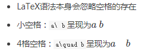

# Math公式教程

## 基本语法

### 呈现位置

- 正文(inline)中的LaTeX公式用`$...$`定义

- 语句为`$...$`
    $$
    \sum_{i=0}^N\int_{a}^{b}g(t,i)\text{d}t
    $$

- 显示在当前行内

    ```
    (简书目前不支持mathjax 只好暂时用图片代替了→_→)
    ```

- 单独显示(display)的LaTeX公式用`$$...$$`定义，此时公式居中并放大显示

- 语句为`$$...$$`
    $$
    \sum_{i=0}N\int_{a}{b}g(t,i)\text{d}t
    $$
    

- 下列描述语句中若非特别指出均省略`$...$`

### 希腊字母

| 显示 |   命令   | 显示 |  命令  |
| :--: | :------: | :--: | :----: |
|  α   |  \alpha  |  β   | \beta  |
|  γ   |  \gamma  |  δ   | \delta |
|  ε   | \epsilon |  ζ   | \zeta  |
|  η   |   \eta   |  θ   | \theta |
|  ι   |  \iota   |  κ   | \kappa |
|  λ   | \lambda  |  μ   |  \mu   |
|  ν   |   \nu    |  ξ   |  \xi   |
|  π   |   \pi    |  ρ   |  \rho  |
|  σ   |  \sigma  |  τ   |  \tau  |
|  υ   | \upsilon |  φ   |  \phi  |
|  χ   |   \chi   |  ψ   |  \psi  |
|  ω   |  \omega  |      |        |

- 若需要大写希腊字母，将命令首字母大写即可。`\Gamma`
    $$
    Gamma=\Gamma
    $$

- 若需要斜体希腊字母，将命令前加上var前缀即可。`\varGamma`
    $$
    varGamma=\varGamma
    $$

### 字母修饰

#### 上下标

- 上标：`^`

- 下标：`_`

    ```
    C_n^2
    ```

    
    $$
    C_n^2
    $$

#### 矢量

`\vec`

```
\vec a
```


$$
\vec a
$$
`\overrightarrow`

```
\overrightarrow{[xy]}
```


$$
\overrightarrow{[xy]}
$$

#### 字体

```
Typewriter=\mathtt{A}\\
Blackboard=\mathbb{A}\\
Sans Serif=\mathsf{A}
```


$$
Typewriter=\mathtt{A}\\
Blackboard=\mathbb{A}\\
Sans Serif=\mathsf{A}
$$

#### 分组

使用`{}`将具有相同等级的内容扩入其中，成组处理

```
错误：10^10\\
正确：10^{10}
```


$$
错误：10^10\\
正确：10^{10}
$$

#### 括号

```
小括号()\\
中括号[]\\
尖括号\langle,\rangle 此处与分组符号\{\}相区别使用转义字符\\
自适应：(\frac{x}{y}), \left(\frac{x}{y}\right)
```


$$
小括号()\\
中括号[]\\
尖括号\langle,\rangle 此处与分组符号\{\}相区别使用转义字符\\
自适应：(\frac{x}{y}), \left(\frac{x}{y}\right)
$$

#### 求和、极限与积分

求和：`\sum`

```
\sum_{i=1}^n{a_i}
```


$$
\sum_{i=1}^n{a_i}
$$
极限：`\lim`

```
\lim_{x\to0}
```


$$
\lim_{x\to0}
$$
积分：`\int`

```
\int_0^\infty{fxdx}
```


$$
\int_0^\infty{fxdx}
$$

#### 分式与根式

分式：`\frac`

```
\frac{1}{2}
```


$$
\frac{1}{2}
$$
根式：\`sqrt`

```
\sqrt[x]{y}
```


$$
\sqrt[x]{y}
$$

#### 特殊函数

```
\sin x\ \ln x\ \max(A,B,C)
```


$$
\sin x\ \ln x\ \max(A,B,C)
$$


#### 特殊符号


#### 空格



### 矩阵

#### 基本语法

起始标记`\begin{matrix}`，结束标记`\end{matrix}`
每一行末尾标记`\\\`，行间元素之间以`&`分隔
举例:

```ruby
$$\begin{matrix}
1&0&0\\
0&1&0\\
0&0&1\\
\end{matrix}$$
```

呈现为：


#### 矩阵边框

- 在起始、结束标记处用下列词替换 `matrix`
- `pmatrix` ：小括号边框
- `bmatrix` ：中括号边框
- `Bmatrix` ：大括号边框
- `vmatrix` ：单竖线边框
- `Vmatrix` ：双竖线边框

#### 省略元素

- 横省略号：`\cdots`
- 竖省略号：`\vdots`
- 斜省略号：`\ddots`
    举例

```ruby
$$\begin{bmatrix}
{a_{11}}&{a_{12}}&{\cdots}&{a_{1n}}\\
{a_{21}}&{a_{22}}&{\cdots}&{a_{2n}}\\
{\vdots}&{\vdots}&{\ddots}&{\vdots}\\
{a_{m1}}&{a_{m2}}&{\cdots}&{a_{mn}}\\
\end{bmatrix}$$
```

呈现为：


#### 阵列


举例

```swift
$$\begin{array}{c|lll}
{↓}&{a}&{b}&{c}\\
\hline
{R_1}&{c}&{b}&{a}\\
{R_2}&{b}&{c}&{c}\\
\end{array}$$
```

呈现为


#### 方程组

- 需要cases环境：起始、结束处以{cases}声明

举例

```cpp
$$\begin{cases}
a_1x+b_1y+c_1z=d_1\\
a_2x+b_2y+c_2z=d_2\\
a_3x+b_3y+c_3z=d_3\\
\end{cases}
$$
```

呈现为


## 参考文献

[MathJax tutorial](https://link.jianshu.com/?t=http://meta.math.stackexchange.com/questions/5020/mathjax-basic-tutorial-and-quick-reference)